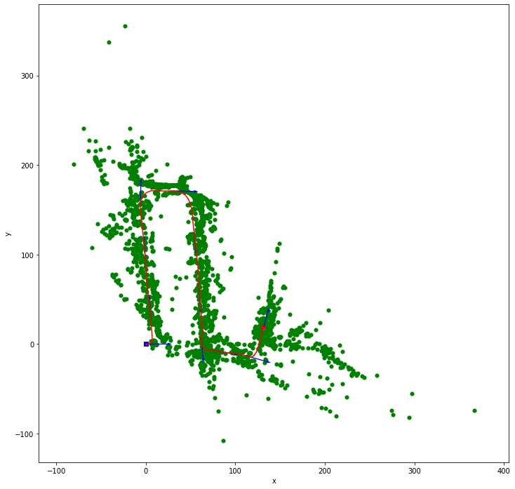
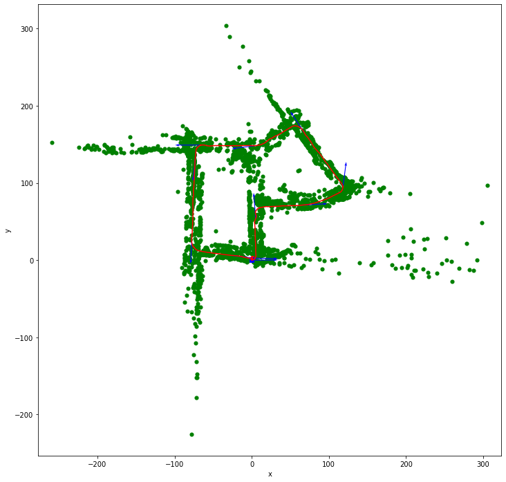
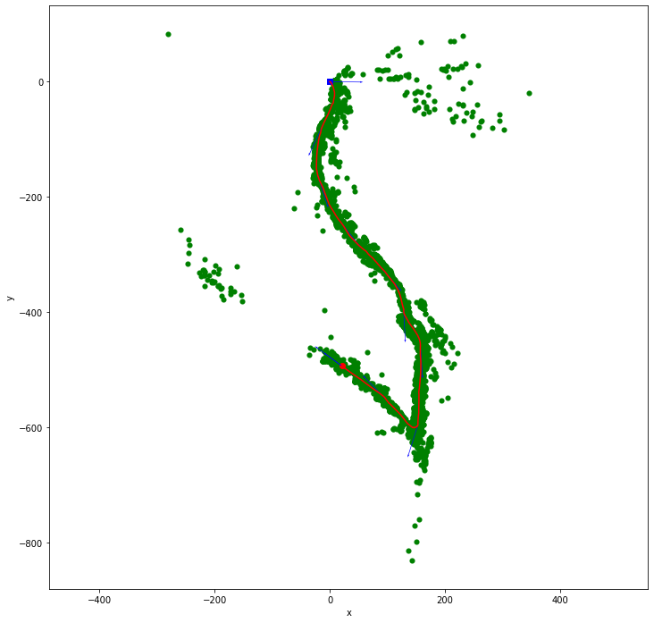

# Visual-Inertial SLAM
This is the project 3 of the course UCSD ECE276A: Sensing & Estimation in Robotics.

Simultaneous Localization And Mapping (SLAM) is a challenging topic in robotics and has been researched for a few decades. When building a map from the observations of a robot, a good estimate of the robot's location is necessary. However, a robot needs a consistent and reliable map for localization. SLAM is the computational problem to simultaneously estimates a map of the environment and pose of a moving robot relative to that map, without any a-priori information external to the robot except for the observations of the robot. SLAM approaches are capable of building the map online while correcting the errors of its pose estimate as it sensing the surroundings.

In this project, we develop a solution for visual-inertial SLAM based on Extended Kalman Filter(EKF) and landmark. We evaluated the proposed solution with real-world measurements from an IMU and a stereo camera installed in a car. It can estimate reliable maps and trajectory on various datasets in a reasonable time.

## Project Report

* [Chun-Nien Chan. "Extended Kalman Filter based Visual-Inertial SLAM." 18 Mar. 2020. ECE 276A, UCSD, student paper](report/visual_inertial_slam.pdf)

## Screenshots

[Demo videos](https://drive.google.com/drive/folders/128FxaI0MJdUfC-T4Xk-ZYas-2dCAwhND?usp=sharing)

## Implementations:
### Source files
- **src/robot.py**: Functions for rotations and transformations
- **src/mapping.py**: Class for landmark mapping via EKF update (Part b)
    - EKFLandmarkMapping: Class provides methods for EKF update and predict. You may achieve IMU-based localization via EKF prediction (Part a) by calling predict method with u (linear velocity and angular velocity) only.
- **src/slam.py**: Class for visual inertial SLAM (Part c)
    - EKFSLAM: Class provides methods for EKF update and predict.
- **src/utils.py**: Functions for data loading and visualization

### Tools
- **tools/make_video.py**: make video from experiment output images

### Notebooks
- **EKFLandmarkMapping.ipynb**: Experiments of landmark mapping via EKF update (Part b) with IMU-based localization via EKF prediction (Part a)
- **EKFSLAM.ipynb**: Experiments of visual inertial SLAM (Part c)

## Training data
[Download data from UCSD ECE276A 2020 PR3](https://drive.google.com/file/d/1vQaMMZltsjPQN18BdrvquTpXoq7fyoyg/view?usp=sharing)

Download and extract files to directory `data`.

## References
* [UCSD ECE276A: Sensing & Estimation in Robotics](https://natanaso.github.io/ece276a/)
